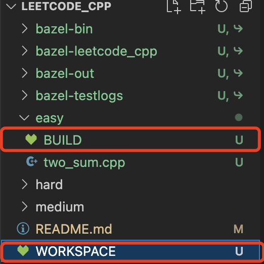

# leetcode_cpp

## bazel编译

1. 安装bazel

   https://bazel.build/install/os-x?hl=zh-cn

2. 创建cpp项目，初始化BUILD文件和WORKSPACE文件

   

3. bazel run

   

## codes

### easy

[two_sum.cpp](./easy/two_sum.cpp)

### medium

### hard
